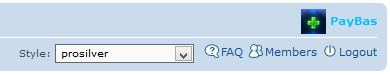

Quick Style for phpBB 3.1
==========

Extension for phpBB 3.1 to let visitors quickly switch board styles.

##### Based on Prime Quick Style for phpBB 3.0, by Ken F. Innes IV ([primehalo](http://www.absoluteanime.com/admin/mods.htm))

## Features
- Adds a drop-down selector to the header, which detects a selection change and triggers a board style change through the UCP.
- Automatically redirects back to the original page being viewed after style has changed.
- Works for guests too, but uses a special cookie instead.
- ACP module to set guest access and whether to use the default template location: `EVENT overall_header_navigation_prepend`

#### Requirements
- phpBB 3.1.2 or higher
- PHP 5.3.3 or higher

#### Languages supported
- English
- Spanish
- Estonian
- Arabic
- Croatian
- Russian
- Dutch

#### To do list
- Choose a better template event to include it in the header. The current position is not ideal. Especially for responsive layout.
- Perhaps switch from an old-school <select> element to something more fancy.

## Installation
1. [Download the latest release](https://github.com/PayBas/QuickStyle/releases) and unzip it.
2. Copy the entire contents from the unzipped folder to `phpBB/ext/paybas/quickstyle/`.
3. Navigate in the ACP to `Customise -> Manage extensions`.
4. Find `Quick Style` under "Disabled Extensions" and click `Enable`.

## Uninstallation
1. Navigate in the ACP to `Customise -> Manage extensions`.
2. Click the `Disable` link for `Quick Style`.
3. To permanently uninstall, click `Delete Data`, then delete the `quickstyle` folder from `phpBB/ext/paybas/`.

### License
[GNU General Public License v2](http://opensource.org/licenses/GPL-2.0)

© 2015 - PayBas